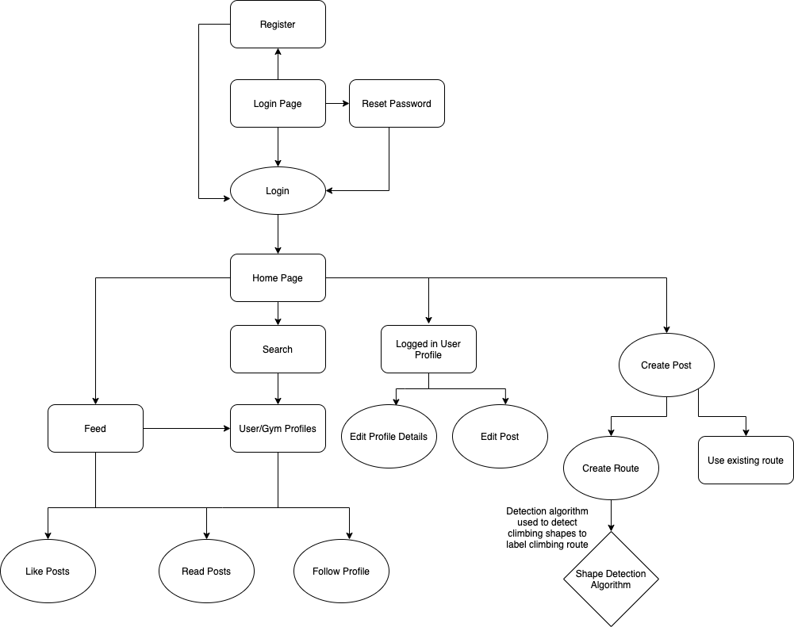

# Allez - Orbital 2021

[)](https://circleci.com/gh/yeppog/allez/tree/master)

Proposed Level of Achievement: Apollo 11

**Motivation**

Imagine you&#39;re stuck on a route while climbing and you&#39;re having a mental breakdown because there&#39;s nobody to show you how to complete the route you want to know what is a method to do so, i.e. the beta but you can&#39;t find the beta online.

There are indeed many climbing Instagram pages online that may have the beta that you are looking for, but they are messy, unorganised, and often hard to find especially if you don&#39;t follow these pages. To solve this, **Allez** eliminates the hassle of looking through Instagram tirelessly, through building a social media beta-sharing platform solely for the purpose of rock climbing sharing.

**Aim**

We hope to be able to categorise routes and betas efficiently such that users are able to search for them quickly. We also hope to allow climbing gyms to have a special account such that they can manage their routes, as well as upload their in-house beta.

**User Stories**

1. As a climber who is stuck on a route, I would be able to quickly look up the solution of the current route that I am on efficiently.
2. As a professional climber who knows how to solve this route, I would be able to upload my own beta to the route where others can view.
3. As an owner of a rock climbing gym, I would be able to publish my route rotations for the week, as well as upload betas of the gym.
4. As a user of any sort, I would be able to share and discuss solutions to these routes on the platform and interact with other users.
5. As a user of any sort, I want to be able to post my thoughts and feed where others in my network can comment on.
6. As a user of any sort, I want to be able to follow and receive updates on people/gyms that I am interested in hearing from.
7. As a user of any sort, I want to be able to upload my own custom routes.

**Features and Timeline**

A **web-based social media site** which provides a place for climbers to share their betas (solutions) to climbing problems for climbers to see and learn.

This acts as a customised and targeted social media platform that climbers can use to quickly search up solutions and share their own personal solutions.

Gyms can submit their own routes and there can be community submitted routes as well.

When creating routes, users submit an image of the route which is processed by our backend to allow users to select and label the holds (start, end, footholds, etc). This makes it much easier for a user to submit a route.

Users will be able look through posts sorted by the routes that they are interested in and submit their betas under a route or create their own.

Features to be completed by the mid of June:

1. Account creation (authentication)
2. Basic front-end design of the site
3. Simple CRUD features.
4. Backend design and relations.

Features to be completed by the mid of July:

1. Implementation of video uploads (optimisation, compression)
2. Social network to be implement (user relations, followers, etc)
3. Frontend main features to be completed (posting, liking, commenting, submission of routes, tags)
4. Shape detection algorithm to identify route holds for easier route creation.

**Object Diagram**

**Program Flow**

**Deployment**

The project can be accessed from the following links

Frontend: <https://allez-orbital.netlify.app/>

Backend: <https://allez-orbital.herokuapp.com/>

## Getting Started

1. Clone this repository by running `git clone`.

2. `cd` into `client` and `server` and run the command `npm start`.
